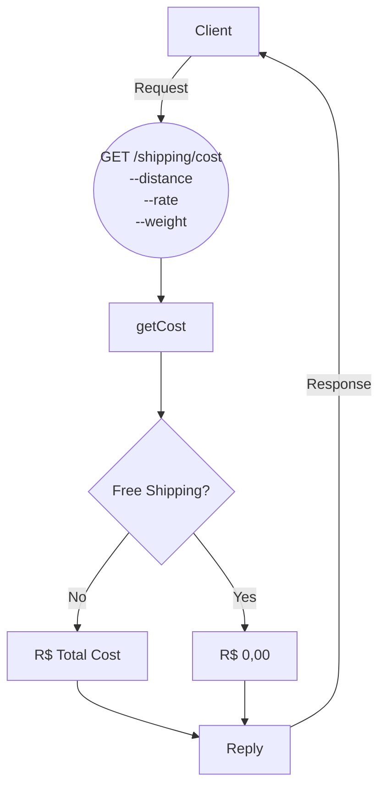

## Talk TDD + Jest + Node

Vamos contruir um endpoint que calcula o custo de uma entrega, **cobrindo nossa regra de negócios com testes unitários** e conhecendo alguns recursos do Jest para nos ajudar a testar **entrada e saída** de nossas funções.

### Fluxo do negócio

